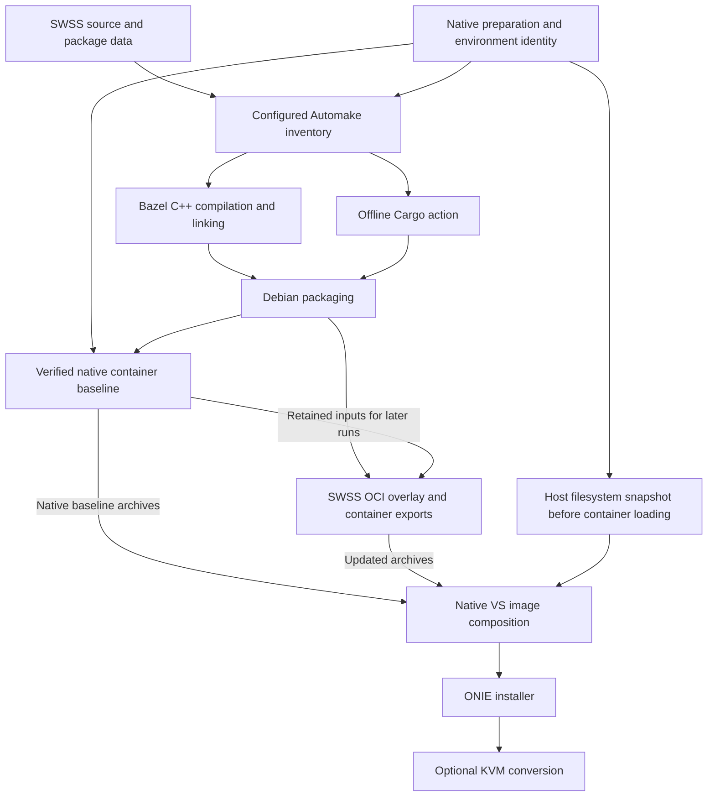

# Alternative HLD: Incremental SWSS and SONiC VS Builds with Bazel

## Table of Contents

1. [Revision](#1-revision)
2. [Scope](#2-scope)
3. [Definitions/Abbreviations](#3-definitionsabbreviations)
4. [Overview](#4-overview)
5. [Requirements](#5-requirements)
6. [Architecture Design](#6-architecture-design)
7. [High-Level Design](#7-high-level-design)
   - [7.a Launcher and preparation](#7a-launcher-and-preparation)
   - [7.b SWSS compilation](#7b-swss-compilation)
   - [7.c Debian packaging](#7c-debian-packaging)
   - [7.d Container graph and OCI updates](#7d-container-graph-and-oci-updates)
   - [7.e Host filesystem and installer](#7e-host-filesystem-and-installer)
   - [7.f Cache and invalidation model](#7f-cache-and-invalidation-model)
   - [7.g Isolation and failure handling](#7g-isolation-and-failure-handling)
   - [7.h Outputs and observability](#7h-outputs-and-observability)
   - [7.i Concurrency and performance model](#7i-concurrency-and-performance-model)
8. [SAI API](#8-sai-api)
9. [Configuration and management](#9-configuration-and-management)
   - [9.1 Manifest](#91-manifest)
   - [9.2 CLI/YANG model Enhancements](#92-cliyang-model-enhancements)
   - [9.3 Config DB Enhancements](#93-config-db-enhancements)
10. [Warmboot and Fastboot Design Impact](#10-warmboot-and-fastboot-design-impact)
    - [Warmboot and Fastboot Performance Impact](#warmboot-and-fastboot-performance-impact)
11. [Memory Consumption](#11-memory-consumption)
12. [Restrictions/Limitations](#12-restrictionslimitations)
13. [Testing Requirements/Design](#13-testing-requirementsdesign)
    - [13.1 Unit Test cases](#131-unit-test-cases)
    - [13.2 System Test cases](#132-system-test-cases)
14. [Open/Action items](#14-openaction-items)

### 1. Revision

| Date | Author | Description |
| --- | --- | --- |
| 2026-09-27 | securely1g | Initial record of the alternative implementation at the revisions below. |

### 2. Scope

This document records an alternative, opt-in approach for incremental SWSS and SONiC VS builds. It is a separate implementation record beside the [SONiC Build System Migration HLD](bazel_migration_hld.md). It does not change that HLD's migration plan. The existing HLD focuses on component migration and excludes full image assembly; this record describes a narrower platform configuration that includes image composition and installer construction.

The implementation snapshot is:

| Repository | Branch | Revision | Responsibility |
| --- | --- | --- | --- |
| [sonic-swss](https://github.com/securely1g/sonic-swss/tree/3998ca391da00400fe28d2912bf0399d4cb398b5) | `bazel` | `3998ca391da00400fe28d2912bf0399d4cb398b5` | SWSS compilation and Debian packaging |
| [sonic-buildimage](https://github.com/securely1g/sonic-buildimage/tree/6e1eb6baae67a34b9a7d031d7bca7d436c86fc83) | `bazel` | `6e1eb6baae67a34b9a7d031d7bca7d436c86fc83` | Preparation, containers, VS filesystem, and installer |

The recorded configuration is public VS on amd64 and Trixie, using the normal release package split. The validated image reported Debian 13.7. No target SONiC release or adoption schedule is assigned by this record.

The implementation was validated for an incremental VS image and ONIE installer build using retained artifacts. Section 13 records the evidence and its limits. Planned extensions are separated in Section 14.

### 3. Definitions/Abbreviations

| Term | Meaning in this document |
| --- | --- |
| Bazel action | A build step whose declared inputs and outputs Bazel tracks and can cache. |
| Native | The existing SONiC Make, Docker, and Debian packaging paths. |
| `sonic-slave` | The SONiC build container that supplies the configured compiler, tools, libraries, and privileged build environment. |
| Receipt | A JSON record binding source/configuration identity to artifact hashes and sizes. |
| Retained baseline | A saved successful native container build: selected archives, the runtime SWSS DEB, and their input receipt. |
| Host snapshot | The host filesystem captured immediately before container loading. |
| OCI | Open Container Initiative image and layer formats. |
| ONIE | Open Network Install Environment; the target installer format used here. |
| VS | SONiC virtual switch platform. |

### 4. Overview

The design makes a SWSS source change flow through the complete image pipeline:

1. Compile affected SWSS sources and relink affected programs.
2. Produce `swss` and `swss-dbg` Debian packages.
3. Update every selected container that consumes SWSS.
4. Reuse the host filesystem built before container loading.
5. Compose the VS filesystem and produce the ONIE installer.

Bazel owns the dependency graph and cached artifact outputs. Native SONiC tooling still prepares the environment and executes filesystem and installer recipes.

For compatible SWSS payload changes, an OCI path reuses verified native layers, appends a shared SWSS update layer, and exports updated archives without invoking a Docker daemon for container construction. A native container build supplies the initial baseline.

The design keeps component build and packaging logic in `sonic-swss`, while `sonic-buildimage` owns the generated workspace and image graph. The current implementation uses local caches and does not provision a shared cache service.

### 5. Requirements

| Area | Requirement |
| --- | --- |
| Incremental compilation | A C++ source edit rebuilds the affected compilation and program link rather than the complete SWSS source tree. |
| Package contract | Produce the existing `swss` and `swss-dbg` formats through debhelper, preserving declared paths, modes, ownership, dependencies, and debug information. |
| Container propagation | Derive the SWSS-consuming container set from evaluated Make dependencies and update all selected descendants. |
| Image propagation | Compose the image from current container outputs while reusing a compatible host snapshot. |
| Source protection | Run native source mutations in an independent staged checkout. |
| Reuse validation | Check receipts, content hashes, environment identity, and OCI descriptors before reuse. |
| Unsupported inputs | Fail with a diagnostic when a configuration or package shape lacks an explicit representation. |
| Compatibility | Keep the normal native build path available. |

The initial supported tool and platform configuration is:

| Dimension | Scope |
| --- | --- |
| Platform and architecture | Public VS; amd64 execution and target |
| Distribution | Trixie |
| Package mode | Normal release `swss` and `swss-dbg` split |
| Bazel | 8.5.1 |
| Bazel dependencies | `rules_cc` 0.1.1; `rules_img` 0.3.22 for OCI builds |
| Compiler and system dependencies | The same prepared `sonic-slave` environment used to configure SWSS |
| Host facilities | Normal public SONiC prerequisites, including Git, Make, Docker, `j2`, and privileged filesystem mounts |

The launcher exposes `swss`, `container`, `vs`, and `vs-kvm` targets. The KVM target requires the native KVM prerequisites, including `/dev/kvm`. It was not exercised by the validation in Section 13. Configuration exclusions are listed in Section 12 and enforced by the [buildimage driver](https://github.com/securely1g/sonic-buildimage/blob/6e1eb6baae67a34b9a7d031d7bca7d436c86fc83/scripts/bazel/driver.py#L89).

### 6. Architecture Design

This is a build-system extension, not a SONiC Application Extension. It changes how selected artifacts are constructed. It adds no runtime SWSS, syncd, database, or management service architecture.



| Stage | Execution engine | Reuse boundary |
| --- | --- | --- |
| Native prerequisites | SONiC Make inside `sonic-slave` | Receipt containing configuration and artifact hashes |
| SWSS C++ | Bazel `rules_cc` | Individual source compilation and program linking |
| `countersyncd` | Cargo invoked by Bazel | One action for the complete Rust binary |
| Debian packages | `dpkg-buildpackage` and debhelper invoked by Bazel | One action producing both packages and their manifest |
| Container baseline | Native Make/Docker invoked by Bazel | Selected container archives |
| Container updates | OCI adapter and `rules_img` | Retained imports, shared overlay, and independent exports |
| Host, image, ONIE, and KVM | Native SONiC recipes invoked by Bazel | Separate file-producing actions |

Native actions remain local because they use the mounted checkout, Docker, and privileged filesystem operations. The generated Bazel workspace lives under `target/bazel/native-source/target/bazel/workspace` in the buildimage checkout.

### 7. High-Level Design

#### 7.a Launcher and preparation

From the `sonic-buildimage` root, the supported entrypoint is:

```sh
./scripts/bazel/run <target> --jobs 8
```

The launcher defaults to the sibling `../sonic-swss` checkout; `--swss-source` selects another source tree. Its targets are:

| Target | Outputs |
| --- | --- |
| `swss` | `swss_1.0.0_amd64.deb`, `swss-dbg_1.0.0_amd64.deb`, and package manifest |
| `container` | SWSS packages, shared SWSS layer, and `docker-orchagent.gz` |
| `vs` | SWSS packages, selected dependent containers, filesystem outputs, and `sonic-vs.bin` |
| `vs-kvm` | VS chain plus BIOS and UEFI KVM image archives |

Each invocation stages the current buildimage and SWSS sources into an independent working tree under `target/bazel/native-source`. This includes local tracked and untracked source changes. Native recipes can modify that staged tree without changing the caller's branches. Missing submodules are initialized only when their paths contain no local files.

The launcher builds or reuses the public Trixie slave, resolves its immutable image ID, and uses separate slave invocations for preparation and the Bazel build. Preparation evaluates the Make graph and builds or reuses static prerequisites. The build invocation verifies that receipt, installs compile dependencies, configures SWSS, prepares locked Cargo dependencies, and generates the workspace.

The environment identity covers installed tools and packages, prerequisite hashes, and evaluated native configuration. It is passed into Bazel action keys. SWSS configuration and workspace generation are refreshed on each invocation, which contributes to launcher time even when Bazel outputs are cached.

The buildimage branch also contains native prerequisite fixes used to complete the recorded build, including SHA-256 checks for selected public Debian 11 P4C sources, verified optional source overrides for Monit and sFlow components, Docker readiness handling, temporary build CA handling, and cleanup. These remain native preparation responsibilities. See the [launcher](https://github.com/securely1g/sonic-buildimage/blob/6e1eb6baae67a34b9a7d031d7bca7d436c86fc83/scripts/bazel/run#L117), [preparation logic](https://github.com/securely1g/sonic-buildimage/blob/6e1eb6baae67a34b9a7d031d7bca7d436c86fc83/scripts/bazel/driver.py#L226), and [P4C source checks](https://github.com/securely1g/sonic-buildimage/blob/6e1eb6baae67a34b9a7d031d7bca7d436c86fc83/src/p4lang/Makefile#L42).

#### 7.b SWSS compilation

`sonic-swss/bazel/generate.py` reads the configured Automake tree and records selected subdirectories, installed programs and data, sources, compiler/linker options, and package information. It writes a generated Bazel package, source inputs, `inventory.json`, and an ownership marker. Synchronization preserves unchanged files and removes stale generated inputs.

The generator creates one `cc_binary` for each configured program. Bazel compiles each translation unit separately, allowing a C++ edit to rebuild its affected object and program. Headers are grouped in a shared target, so header changes can affect a broader set of programs. System headers and libraries come from the prepared slave rather than standalone Bazel dependency targets.

`countersyncd` is a separate action running:

```sh
cargo build --release --locked --offline --bin countersyncd
```

Its inputs include local Rust sources, `Cargo.lock`, normalized Cargo configuration, and a deterministic archive of vendored dependencies. Dependency downloads happen during `cargo vendor --locked` preparation. The build action uses temporary Cargo directories and disables Cargo incremental compilation, so a Rust edit reruns the complete action. A C++ edit can reuse its output.

See the [generator](https://github.com/securely1g/sonic-swss/blob/3998ca391da00400fe28d2912bf0399d4cb398b5/bazel/generate.py#L134) and [Cargo action](https://github.com/securely1g/sonic-swss/blob/3998ca391da00400fe28d2912bf0399d4cb398b5/bazel/build_cargo.py#L20).

#### 7.c Debian packaging

One package action consumes all program executables, `countersyncd`, runtime data, Debian metadata, and the generated inventory. It stages the C++ executables and configured Automake data with a manifest of their paths, modes, and hashes. It copies `countersyncd` and the declared package sources into a temporary package source tree, then sets `SONIC_BAZEL_STAGEDIR` and runs:

```sh
dpkg-buildpackage -b -uc -us -nc
```

The staged branches in `debian/rules` validate and install the C++/Automake stage. The existing debhelper sequence installs `countersyncd` and the declared `debian/swss.install` sources from the temporary package tree, computes dependencies, generates package metadata, and splits debug information into `swss-dbg`. Normal builds without the variable continue through Autotools and Cargo.

Before exposing both DEBs and their manifest, the action checks package identity, required paths and modes, root ownership, ELF signatures, declared data contents, runtime dependency presence, and debug information. Each C++ program input must contain DWARF; `countersyncd` is checked as ELF. The debug package must depend on the matching SWSS version and contain at least one ELF with DWARF data.

The component checker does not compare the entire package with a native baseline, execute binaries, or verify every binary's build ID, debug link, and debugger source mapping. See [package construction and checks](https://github.com/securely1g/sonic-swss/blob/3998ca391da00400fe28d2912bf0399d4cb398b5/bazel/package_deb.py#L153).

#### 7.d Container graph and OCI updates

Buildimage derives the affected container set from evaluated Make dependencies. It selects containers that directly consume SWSS or depend on another selected SWSS layer. The `container` target selects the orchagent dependency closure; `vs` and `vs-kvm` select the affected containers needed by their configured image.

There are two container paths:

1. **Native baseline:** When no matching retained baseline exists, Bazel invokes native Make/Docker container actions. After success, the launcher saves the selected archives, runtime SWSS DEB, and their input receipt under `target/bazel/oci-retained-inputs/<contract-sha256>` inside the staged checkout.
2. **OCI update:** A later invocation validates the receipt, current contract, archive hashes, OCI descriptors, and effective installed SWSS state. It creates one shared update layer, appends it to every selected retained image, and exports the existing `docker-*.gz` paths.

Static container prerequisites are copied into protected snapshots under `target/bazel/container-static-inputs/<identity-sha256>`. Their receipts cover hashes, sizes, and original target modes.

All selected retained images must agree on the effective SWSS payload, omitted paths, installed package metadata files, package list paths, and SWSS status entry before one shared overlay can be used. The overlay emits changed regular files that the native baseline actually installed, plus updated package checksums. It preserves the native policy for omitted package files. Package control metadata, conffiles, path and metadata inventory, and hardlink contents must remain compatible.

The contract permits SWSS package bytes and image stamping values to change. The retained native comparison removes the root commit ID and excludes a named source set that includes all of `scripts/bazel/driver.py`, `bazel/README.md`, `bazel/oci_defs.bzl`, `scripts/bazel/oci_container.py`, and `scripts/bazel/tests/`. It does not bind the driver's file bytes directly; it relies on generated contract and stage-specification fields to reflect relevant driver changes. The current OCI tool files are declared action inputs, and the generated graph defines the action commands and dependencies.

The `rules_img` export uses the tarball output group and does not select a runtime Docker loader. Independent exports can run in parallel. Missing matching retained inputs select a native baseline build; an incompatible package update against a matching baseline fails validation.

See the [container contract](https://github.com/securely1g/sonic-buildimage/blob/6e1eb6baae67a34b9a7d031d7bca7d436c86fc83/scripts/bazel/oci_container.py#L71), [overlay](https://github.com/securely1g/sonic-buildimage/blob/6e1eb6baae67a34b9a7d031d7bca7d436c86fc83/scripts/bazel/oci_container.py#L1034), and [generated OCI rules](https://github.com/securely1g/sonic-buildimage/blob/6e1eb6baae67a34b9a7d031d7bca7d436c86fc83/scripts/bazel/driver.py#L453).

#### 7.e Host filesystem and installer

The host filesystem action stops immediately before container loading. Its declared inputs exclude the SWSS packages and affected containers, allowing a compatible SWSS edit to reuse the host snapshot.

The downstream image action restores the snapshot, loads current container archives, and runs native finalization and compression to produce `fs.squashfs`, `dockerfs.tar.gz`, and `fs.zip`. A separate ONIE action produces `sonic-vs.bin`. The optional KVM action produces BIOS and UEFI image archives.

These stages retain native SONiC tooling and Docker. Bazel tracks their file outputs as distinct actions. See the [image graph](https://github.com/securely1g/sonic-buildimage/blob/6e1eb6baae67a34b9a7d031d7bca7d436c86fc83/scripts/bazel/driver.py#L638).

#### 7.f Cache and invalidation model

The design uses three storage mechanisms: native preparation receipts, Bazel repository/disk caches, and retained OCI baselines.

| Build step | Important inputs | Effect of a compatible SWSS C++ change |
| --- | --- | --- |
| Native preparation | Native sources, Make inventory, slave image, environment, prerequisite hashes | Reuses matching prerequisites |
| C++ compilation/linking | Source, headers, options, environment identity | Rebuilds affected objects and programs |
| Cargo | Rust sources, lockfile, vendor archive, configuration, environment | Reuses output |
| Debian packaging | Executables, runtime data, Debian metadata, inventory | Rebuilds when package inputs change |
| OCI imports | Retained archives, baseline DEB, receipt, contract | Reuses matching imports |
| OCI overlay/exports | New DEB, retained installed state, image stamping inputs | Produces updated archives |
| Host snapshot | Static native inputs and native source manifest | Reuses snapshot |
| Image and ONIE | Host snapshot, current containers, filesystem outputs | Rebuilds downstream outputs |

The default Bazel repository and disk caches are under `target/bazel/native-source/target/bazel` in the caller's buildimage checkout. No cache server is provisioned. Native preparation can use SONiC's package cache with `--native-dpkg-cache-method rwcache`, subject to the existing matching slave-tag check; its default is `none`. Bazel-owned native actions disable that package cache so Bazel controls reuse of their outputs.

The native source manifest is broad because reused Make recipes read many paths. An unrelated buildimage edit can therefore invalidate native stages. Native mirror metadata is outside the Bazel graph, and host/image/installer stages retain live static input paths. Changes to mirror contents or dependency selection require native preparation to be refreshed.

#### 7.g Isolation and failure handling

The implementation protects shared native build state as follows:

- Source staging uses independent Git state and checks ownership and path containment.
- Native actions verify the source/environment manifest before and after execution.
- A lock serializes native actions that share filesystem paths.
- Image composition runs in private PID and mount namespaces; its worker reaps descendants and waits for terminal cleanup.
- Cleanup unmounts verified task mounts and checks that the host scratch root is clean.
- Docker-root ownership is returned only after checking directory identity, namespace state, processes, and mounts.
- Declared outputs are copied to Bazel only after the native command and cleanup succeed.

This supports fixing a failed build step and rerunning the launcher while retaining earlier successful Bazel outputs. Native actions disable remote execution and Bazel sandboxing. OCI adapter actions declare network blocking and perform file-based construction; the adapter does not create its own network namespace.

See [native execution](https://github.com/securely1g/sonic-buildimage/blob/6e1eb6baae67a34b9a7d031d7bca7d436c86fc83/scripts/bazel/native_action.py#L837) and [image process/mount isolation](https://github.com/securely1g/sonic-buildimage/blob/6e1eb6baae67a34b9a7d031d7bca7d436c86fc83/scripts/bazel/native/image_worker.py#L67).

#### 7.h Outputs and observability

The launcher copies requested user artifacts to:

```text
target/bazel/native-source/target/bazel/artifacts/<target>/
```

This includes the packages, orchagent archive, and requested final image outputs. Other container archives and intermediate filesystem outputs remain in the generated Bazel output tree.

`build-manifest.json` records source revisions, environment identity, output sizes and SHA-256 hashes, the selected container backend, static input receipt, and Bazel profile/execution-log paths. OCI runs also record the retained receipt and overlay report.

The launcher owns the generated workspace. Using it refreshes the source manifest and SWSS configuration before Bazel evaluates reuse. The manifest and execution log are the main serviceability interfaces for explaining rebuilds and locating failed stages.

#### 7.i Concurrency and performance model

C++ compilation and OCI actions can run in parallel up to the configured Bazel job limit. The container set is derived from Make dependencies rather than fixed at eight; the recorded VS configuration selected eight and observed all eight gzip actions overlapping.

Native container baseline, host, image, and installer actions serialize access to shared native paths. The OCI update path removes native container reconstruction from the compatible incremental path, leaving launcher preparation, image composition, and ONIE construction as substantial costs. Section 13.2 records the measured intervals.

### 8. SAI API

This build-system implementation adds no SAI APIs or objects. Existing VS SAI dependencies remain native prerequisites. Runtime SAI behavior was not exercised by the recorded offline validation.

### 9. Configuration and management

#### 9.1 Manifest

This is not a SONiC Application Extension and has no extension manifest. `build-manifest.json` is build provenance; it is not a runtime application manifest.

#### 9.2 CLI/YANG model Enhancements

There are no device CLI, CLICK, KLISH, YANG, REST, gNMI, or SNMP changes. The developer-facing launcher interface is described in Section 7.a. Existing device configuration and management commands retain their current contract.

#### 9.3 Config DB Enhancements

There are no changes to CONFIG_DB, APP_DB, ASIC_DB, COUNTERS_DB, LOGLEVEL_DB, or STATE_DB schemas. References to package metadata in this design concern the container's Debian package database.

### 10. Warmboot and Fastboot Design Impact

The design adds build steps and does not intentionally add runtime services or boot-chain operations. Produced packages and images are intended to preserve the existing startup contract. Installer execution, boot, warmboot, and fastboot were not tested in the recorded run, so behavioral parity remains a system-validation requirement.

#### Warmboot and Fastboot Performance Impact

The design introduces no planned sleeps, stalls, I/O, or CPU-heavy processing into the boot critical chain. The generated image still requires boot testing to confirm this expectation and to verify existing control-plane and data-plane disruption requirements. No boot-time performance result is claimed by this record.

### 11. Memory Consumption

The build path adds no runtime feature process or device memory allocation. Build-host memory can increase with `--jobs` and parallel OCI exports. The recorded run used eight jobs, but no peak-memory study was recorded. Runner sizing and a safe concurrency limit remain CI integration work.

### 12. Restrictions/Limitations

1. Toolchains and system libraries come from a prepared local slave; native actions are not portable remote-execution actions.
2. OCI updates require compatible retained native layers and are not a fresh container bootstrap or general Dockerfile replacement.
3. Package control, conffile, path/metadata inventory, and hardlink changes can be rejected by the OCI overlay.
4. Cargo rebuilds as one action, and shared header dependencies can invalidate multiple programs.
5. Native image and installer stages remain substantial serialized work; the launcher also repeats preparation work.
6. Cross builds, ASAN/debug modes, multi-ASIC KVM, SBOM, signing, post-build hooks, Debian build profiles, and remote SONiC package-manager inputs are outside this graph.
7. The SWSS generator rejects unmodeled build shapes such as generated `BUILT_SOURCES`, installed libraries, local link dependencies, custom Automake install hooks, GCOV packaging, and complex `dh_install` expressions.
8. Native mirror metadata is not fully represented in Bazel inputs.
9. No shared cache service, community CI workflow, or compiler-analysis integration is added by these branches.
10. A complete build from empty caches, installer execution, boot, runtime services, and KVM output validation are not established by the recorded evidence.
11. Package checks do not establish complete native-package equivalence or per-binary debug-symbol correlation.

### 13. Testing Requirements/Design

#### 13.1 Unit Test cases

The SWSS branch includes six generator fixture tests and one staging test. They cover configured source/options selection, package boundaries, deterministic vendor inputs, synchronization, unsupported inputs, the `FPM_PATH` fallback, output ownership, and staged-file validation.

The buildimage branch includes tests for generated dependencies, host-snapshot reuse after a SWSS edit, static input snapshots, source staging and inventory, OCI contracts and overlays, and Docker-root cleanup. Graph tests use stub native actions, so they establish dependency behavior rather than a complete image build.

The recorded test interfaces are:

```sh
# In sonic-swss
python3 -m unittest discover -s bazel/tests -v

# In sonic-buildimage
python3 -m unittest discover -s scripts/bazel/tests -v
```

The generated SWSS graph contains no functional Bazel test targets. Staged `dh_auto_test` validates package staging; SWSS functional tests remain outside the graph. Future CI must also ensure compiler-analysis jobs observe compilation rather than silently reusing cached outputs.

#### 13.2 System Test cases

The results below are recorded observations from local run `20260926T090505.075582Z`. Raw logs and generated artifacts are not included in this documentation change. The run used the revisions in Section 2 plus a temporary change to one logging line in `orchagent/main.cpp`.

The command was:

```sh
./scripts/bazel/run vs --jobs 8 \
  --native-dpkg-cache-method rwcache \
  --bazel-arg=--noslim_profile \
  --bazel-arg=--experimental_profile_include_target_label
```

The launcher exited successfully. The execution record showed one C++ compilation, one orchagent link, one SWSS packaging action, import work for eight images, one shared overlay, eight archive exports, native image composition, and ONIE construction. The imports comprised eight `SonicOciExtract` and eight `ConvertOCILayoutToImageManifest` actions. Of 238 recorded compile inputs, only `main.cpp` changed relative to the matching native preparation run. The updated orchagent payload was found in final DockerFS.

The 51 OCI action records used the Python adapter and pinned `img` commands. They recorded no Docker CLI, daemon, package-installer, or Make command in those actions. `DockerSave` was `img docker-save --format tar`, producing a file. This evidence covers source and recorded action commands rather than every child system call.

The selected archives and native installation roles were:

| Archive | Installation role |
| --- | --- |
| `docker-dash-ha.gz` | Direct installer image |
| `docker-fpm-frr.gz` | Direct installer image |
| `docker-macsec.gz` | Installed through `sonic_local_packages` |
| `docker-nat.gz` | Direct installer image |
| `docker-orchagent.gz` | Direct installer image |
| `docker-sflow.gz` | Direct installer image |
| `docker-swss-layer-trixie.gz` | Dependency base; not installed as a standalone runtime image |
| `docker-teamd.gz` | Direct installer image |

All eight passed checks for retained layer prefixes, appended layers, effective SWSS payload, manifests, package database, and runtime configuration. The seven installed images also passed final DockerFS configuration and version-tag checks. The ONIE installer was 2,635,870,191 bytes with SHA-256 `72b1bde428083910cc5c991b788f21bd2cb4530162970a2cf1bfff892e89358f`.

| Measurement | OCI observation | Earlier Docker observation |
| --- | ---: | ---: |
| Full launcher | **22m 12.738s** | 46m 05.420s |
| Main Bazel invocation | **13m 29.071s** | 35m 31.846s |
| SWSS packaging | 66.166s | 69.078s |
| Container assembly window | 23.300s | 1,227.053s |
| Native image composition | 490.701s | 554.228s |
| ONIE construction | 173.363s | 230.576s |

The full launcher time was 51.8% lower in the OCI observation. Compilation took 21.285 seconds and linking took 4.428 seconds. Leading retained imports took 11.039 seconds and overlapped SWSS work. Eight gzip actions spanned 20.227 seconds, with a peak overlap of eight actions.

Measurement boundaries and validation limits are important:

- There was one observation per backend, with retained artifacts, different buildimage revisions, and different logging markers of equal added length.
- Launcher time includes staging, preparation, main Bazel, and artifact copying. Matching native baseline preparation, a separate 24.280-second source preflight, and post-build validation are excluded.
- The OCI container window runs from overlay start through the last gzip output and excludes leading contract/import work. The Docker window starts at the first of eight `SonicContainer` actions and ends when the last completes. Stage intervals overlap and cannot be added; launcher and main Bazel times are the primary comparisons.
- The run reused native prerequisites, the native package cache, Bazel repository/disk caches, and retained container archives. It does not establish a complete build from empty caches.
- Offline filesystem and installer validation passed using the pinned SquashFS 4.7.5 decoder after the system decoder aborted. Installer execution, boot, runtime services, and KVM images were not tested.
- The temporary source edit was restored, and both implementation worktrees were recorded clean afterward. Source cleanliness does not imply empty build caches.

Future system validation should compare native and Bazel package contracts, execute relevant SWSS tests, boot the image, verify core services and forwarding behavior, exercise warmboot/fastboot, and validate KVM outputs.

### 14. Open/Action items

The following are proposals beyond the recorded branches:

1. Add CI that checks out compatible revisions of both repositories, invokes the launcher, requires named outputs, and retains manifests and execution logs.
2. Establish a complete build from empty caches and test installer execution, boot, core services, and forwarding behavior.
3. Reduce launcher time by reusing more of the verified configured environment while preserving input checks.
4. Break down native filesystem composition where stable input/output boundaries can be defined.
5. Model additional package installation effects or provide an explicit workflow for refreshing native baselines after package-shape changes.
6. Refine header dependencies and evaluate finer Rust build actions.
7. Evaluate a shared cache after verifying that different runners using the same cache key have identical tools and native inputs. Native actions currently remain local.
8. Add detailed debug-symbol matching and compiler-analysis coverage that cannot be bypassed by cache hits.
9. Measure build-host CPU, memory, and disk use across concurrency settings before assigning community CI runner requirements.
